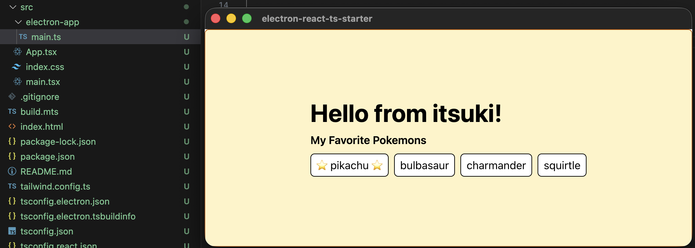

# Electron + React + Typescript + Tailwind Starter App

A skeleton app for using electron/react/typescript and tailwind css to create multi-platform desktop app.

For more details, please refer to my article [Cross-Platform Desktop App with Electron/React/Typescript]()

## Basic Commands
- `npm run dev` to start the react app listening on `localhost:4444`. Use this to confirm and make changes to UI in real time.
- `npm run build:react` to build the react app
- `npm run build:electron` to build the electron app
- `npm run start` to build the react app, the elctron app, as well as start the elctron app.

 

